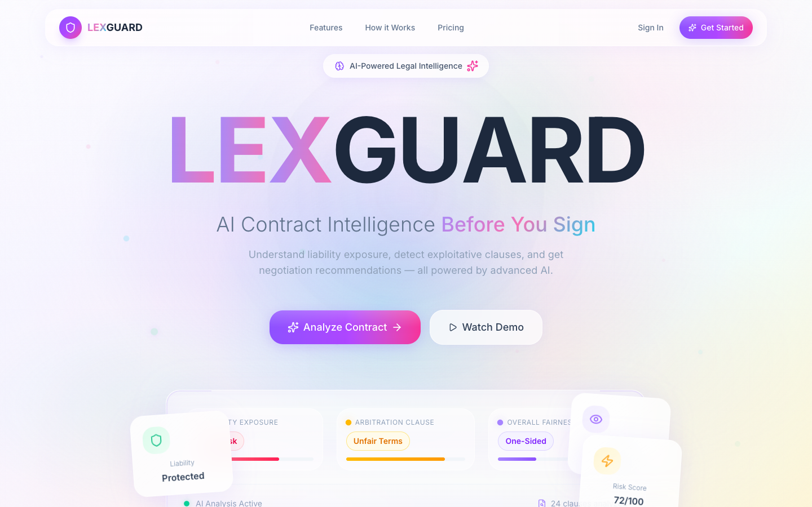
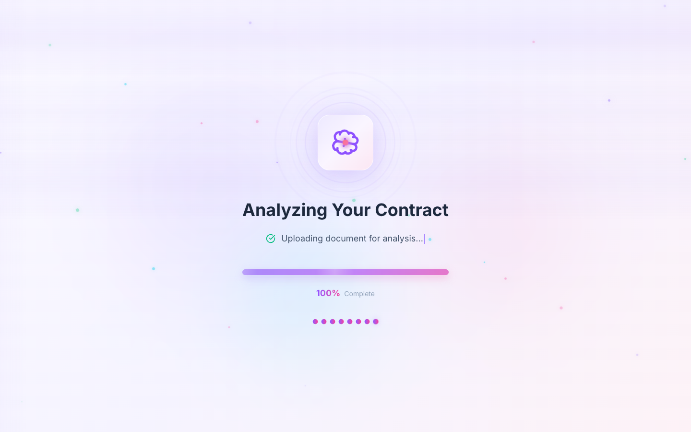
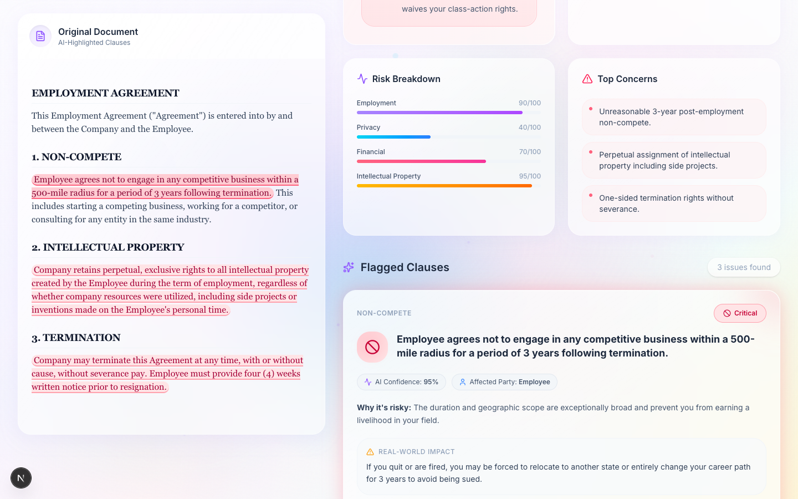
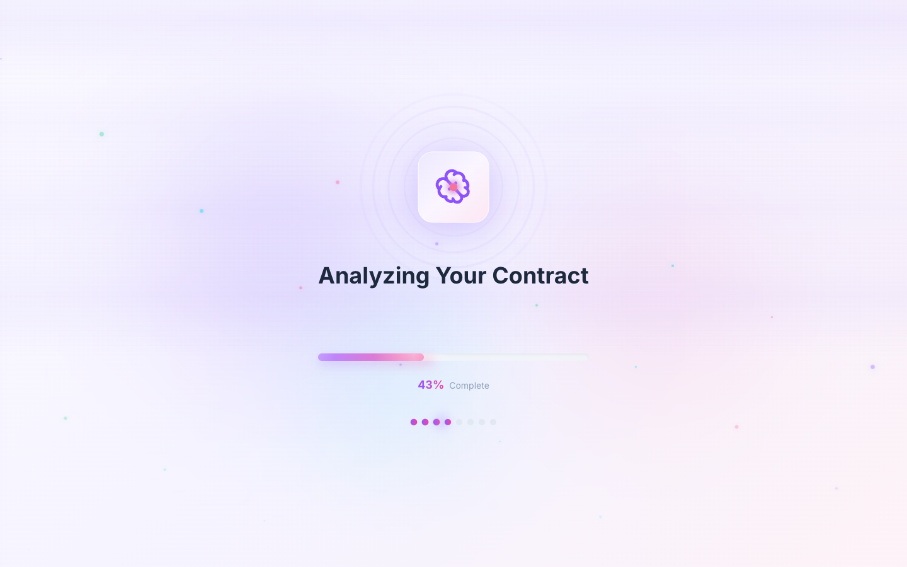
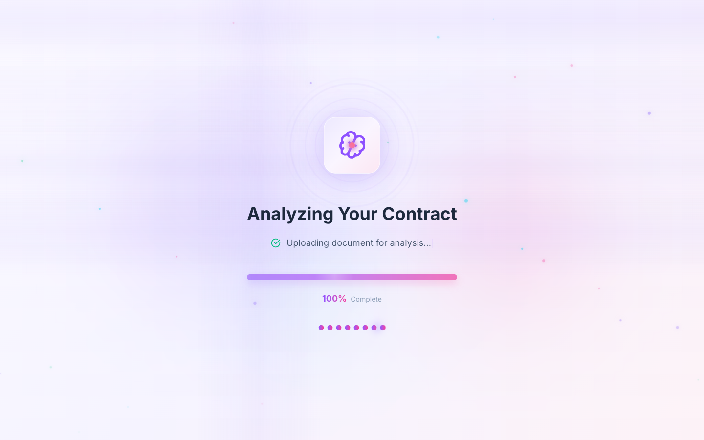

<p align="center">
  
</p>

<h1 align="center">🛡️ LEXGUARD — AI Contract Risk Intelligence System</h1>

<p align="center">
  <strong>Automated, high-fidelity contract scanning powered by multi-agent legal consensus.</strong>
</p>

<p align="center">
  <a href="https://lexguard-frontend-seven.vercel.app/" target="_blank">
    
  </a>
  <a href="https://lexguard-backend-w5k1.onrender.com/" target="_blank">
    
  </a>
  <a href="https://lexguard-backend-w5k1.onrender.com/health" target="_blank">
    
  </a>
</p>

<p align="center">
  
  
  
  
  
</p>

<p align="center">
  LEXGUARD is a world-class, production-grade legal intelligence suite that democratizes contract review. By orchestrating a simulated team of specialized legal AI agents, LEXGUARD scans PDF and DOCX documents to instantly expose hidden liabilities, grade overall fairness, highlight critical clauses, and provide real-world consequence models alongside actionable negotiation tips. 
</p>

---

## ⚖️ Why LEXGUARD?

For decades, traditional legal review has been broken. Startups, freelancers, and small founders are forced into a dangerous compromise: spend thousands of dollars on attorney consultations for basic, standard documents—or sign blind, taking on unhedged, devastating liabilities. 

**LEXGUARD** breaks down this financial gatekeeping. While it does not substitute for professional legal counsel, it grants instantaneous, institutional-grade transparency to anyone. By running a multi-agent consensus scan across critical contract dimensions, LEXGUARD exposes structural imbalances and empowers users to step into negotiations fully protected, fully aware, and with a concrete, actionable playbook.

---

## 📌 Highlights

- ⚡ **AI Multi-Agent Legal Analysis:** Simulated law-firm reviews running five specialized vertical agents in full consensus.
- 🧠 **Gemini 2.5 + Claude Cascade:** Triple-tier architecture (Gemini → Claude → Mock) guaranteeing 100% service availability.
- 🔒 **Production-Grade FastAPI Backend:** Hardened asynchronous endpoints with dynamic CORS and regex-based preview domain whitelist support.
- 🎨 **Glassmorphic Next.js Frontend:** Premium, dark-tech visual aesthetic utilizing Tailwind CSS v4, Framer Motion, and Recharts.
- ☁️ **Fully Deployed Infrastructure:** Deployed and actively synchronized on Vercel and Render platforms.
- 📄 **PDF & DOCX Smart Parsing:** High-density legal text extraction and high-relevancy smart-chunking under 10MB.

---

## 🖼️ Screenshots

| 📊 Main Analytics Dashboard | 🔍 Interactive Contract Viewer |
| :---: | :---: |
|  |  |
| **⚡ Glassmorphic Scanning Experience** | **🤝 Risk Highlighting Panel** |
|  |  |

---

## 📁 Project Structure

```txt
LEXGUARD/
├── lexguard_frontend/
│   ├── app/                 # Next.js App Router pages and layouts
│   ├── components/          # Glassmorphic UI components, charts, and contract viewer
│   ├── lib/                 # Centralized client configuration and API helpers
│   ├── public/              # Static assets and icons
│   └── package.json         # Frontend configuration & dependencies
│
├── lexguard_backend/
│   ├── data/                # Sample agreements and configuration
│   ├── models/              # Pydantic validation schemas
│   ├── prompts/             # Legal agent instruction sets
│   ├── routes/              # FastAPI endpoint routers (analyze, status)
│   ├── services/            # Extraction parsers, unified LLM logic, and cascade agents
│   ├── utils/               # Structured validation and clean normalization helpers
│   ├── requirements.txt     # Python dependencies
│   └── main.py              # Application entrypoint with global handlers & CORS setup
│
└── README.md
```

---

## ✨ Core Features

*   **🔍 High-Fidelity Side-by-Side Contract Viewer:** Read your original document inline with interactive, color-coded markers that highlight high, medium, and low-risk clauses as you click them.
*   **📊 Dynamic Risk Analytics Radar:** Powered by Recharts, visualizes your contract's safety profile across five core dimensions (Employment, Privacy, Finance, Intellectual Property, and Fairness).
*   **🚀 Premium Glassmorphic Scanning Experience:** Engaging scanning animations stream state transitions as virtual legal experts analyze the document in real time.
*   **📁 Smart Multi-Format Parsing:** Seamlessly processes `.pdf`, `.doc`, and `.docx` legal files under 10MB using text extraction algorithms.
*   **🤝 Actionable Negotiation Playbooks:** Provides affected-party indicators, plain-English impact explanations, and ready-to-use counter-clauses or negotiation tips for every flagged risk.

---

## 🧠 AI Multi-Agent Simulation Pipeline

Rather than relying on a single generic LLM pass, LEXGUARD models a professional law firm review. It dynamically executes **five distinct sub-agents**, each specialized in auditing a key legal vertical:

```
                          ┌─────────────────────────┐
                          │ Uploaded Legal Document │
                          └────────────┬────────────┘
                                       │ (Text Parsing & Smart Chunking)
                                       ▼
                     ┌───────────────────────────────────┐
                     │   LEXGUARD Orchestration Agent    │
                     └─────────────────┬─────────────────┘
                                       │
         ┌───────────────┬─────────────┼───────────────┬───────────────┐
         ▼               ▼             ▼               ▼               ▼
   💼 Employment   🔒 Privacy &   💸 Financial    💡 Intellectual ⚖️ Fairness
    Law Agent      Compliance     Liability Agent Property Agent   Evaluation
   (Wage & Terms)  (GDPR/CCPA)    (Indemnity/Fees) (Ownership/IP) (Bilateral Balance)
         │               │             │               │               │
         └───────────────┼─────────────┴───────────────┼───────────────┘
                         │
                         ▼ (Structured Synthesis)
                     ┌───────────────────────────────────┐
                     │   Interactive Results Dashboard   │
                     │  (Scores, Verdicts & Highlights)  │
                     └───────────────────────────────────┘
```

*   **💼 Employment Law Agent:** Audits non-compete reasonableness, misclassification triggers, wage structures, termination notice periods, and working hours.
*   **🔒 Privacy & Compliance Agent:** Scans for telemetry consent, tracking mechanisms, third-party data sharing, GDPR/CCPA disclosures, and breach notice clauses.
*   **💸 Financial Liability Agent:** Evaluates payment terms, automatic renewals, late-payment penalty caps, and unlimited mutual or unilateral indemnity triggers.
*   **💡 Intellectual Property Agent:** Protects creators by identifying assignment of pre-existing work, reverse-engineering bans, and scope limits on work-for-hire transfers.
*   **⚖️ Fairness Evaluation Agent:** Acts as a neutral referee, checking if key provisions (termination, dispute resolution, fee-shifting) are mutual or unfairly biased toward one party.

---

## 🛡️ 100% Uptime Cascade Design

To guarantee that the user interface never breaks in production—even under API outages, rate limits, or network timeouts—the backend implements a robust **three-tier provider cascade**:

```
                       ┌─────────────────────────┐
                       │  Initiate Contract Scan │
                       └────────────┬────────────┘
                                    │
                                    ▼
                      ┌───────────────────────────┐
                      │  [1] Google Gemini 2.5    │ ─── (Success) ───► [Return UI]
                      │          (Primary)        │
                      └─────────────┬─────────────┘
                                    │ (Outage, Latency, or Rate Limit)
                                    ▼
                      ┌───────────────────────────┐
                      │  [2] OpenRouter Claude    │ ─── (Success) ───► [Return UI]
                      │        (Secondary)        │
                      └─────────────┬─────────────┘
                                    │ (Timeout >90s or Both Offline)
                                    ▼
                      ┌───────────────────────────┐
                      │  [3] Cinematic Mock Local │ ─────────────────► [Return UI]
                      │         (Safety Net)      │
                      └───────────────────────────┘
```

1.  **Google Gemini 2.5 Flash (Primary):** Selected for high-speed, native, structured JSON parsing using schemas.
2.  **OpenRouter Claude 3.5 Sonnet (Secondary Fallback):** Automatically triggered with identical schema instructions if Gemini times out or throws an error.
3.  **Cinematic Mock Local JSON (Tertiary Safety Net):** If both external API endpoints are down, or the analysis hits a strict 90-second execution threshold, the backend generates a high-fidelity mock response. This guarantees a smooth dashboard presentation and allows mock-driven walk-throughs to succeed under any conditions.

---

## ⚡ API Endpoints

The backend provides simple, robust, asynchronous JSON interfaces:

| Method | Endpoint | Description |
| :---: | :--- | :--- |
| `POST` | `/analyze-contract` | Accepts legal files (`PDF`/`DOCX`), parses text, smart-chunks, executes AI agent cascade, and returns master analysis schema |
| `GET` | `/analyze-status` | Polling endpoint returning simulated multi-agent milestones to drive frontend scanning loaders |
| `GET` | `/health` | Live diagnostic validation check returning server status, version metadata, and active verification status |
| `GET` | `/` | Base root endpoint displaying service overview, current server time, and API release version |

---

## 🛠️ Tech Stack

### Frontend Service
*   **Framework:** Next.js 16.2.6 (App Router)
*   **Runtime:** React 19.0.0
*   **Styling:** Tailwind CSS v4.2.0 (Dynamic variables + Glassmorphism system)
*   **Animations:** Framer Motion & CSS Animations (`tw-animate-css`)
*   **Visualizations:** Recharts (Interactive Radar and Area components)
*   **Icons & Components:** Radix UI primitives & Lucide React

### Backend Service
*   **Framework:** FastAPI 0.110.0+ (Asynchronous Python)
*   **Server Engine:** Uvicorn
*   **Document Parsers:** PyPDF2 (PDF extraction) & python-docx (Microsoft Word extraction)
*   **AI Integration:** Google Generative AI SDK, HTTPX (Asynchronous OpenRouter communication)
*   **Configuration:** Dotenv (Environment mapping)

---

## 💻 Local Development Setup

Follow these steps to run the complete environment locally:

### Prerequisites
*   [Node.js v18+](https://nodejs.org/)
*   [Python 3.11+](https://www.python.org/)
*   `pnpm` or `npm` package manager

---

### 1. Backend Server Setup

Navigate into the backend folder, initialize a virtual environment, install dependencies, and launch:

```bash
cd lexguard_backend

# Create virtual environment
python3 -m venv venv
source venv/bin/activate  # On Windows: venv\Scripts\activate

# Install required libraries
pip install -r requirements.txt

# Create .env from template
cp .env.example .env   # Or edit existing .env with your keys

# Run development server (runs on port 8000 by default with hot-reloading)
python main.py
```

---

### 2. Frontend Client Setup

Navigate into the frontend folder, install the packages, and boot up:

```bash
cd lexguard_frontend

# Install dependencies using pnpm (recommended) or npm
pnpm install
# or
npm install

# Setup local environment variables
cp .env.example .env.local  # Ensure API URL points to http://127.0.0.1:8000

# Start Next.js development server (runs on port 3000 by default)
pnpm dev
# or
npm run dev
```

Open [http://localhost:3000](http://localhost:3000) in your browser to interact with the suite!

---

## ⚙️ Environment Configurations

### Backend `.env`
Add these keys to `lexguard_backend/.env` for local operation:

```env
GEMINI_API_KEY=AIzaSy...your_gemini_key_here
PORT=8000
HOST=0.0.0.0
DEBUG=True
OPENROUTER_API_KEY=sk-or-...your_openrouter_key_here
OPENROUTER_MODEL=anthropic/claude-3.5-sonnet
FRONTEND_URL=http://localhost:3000,http://127.0.0.1:3000
```

### Frontend `.env.local`
Add these variables to `lexguard_frontend/.env.local` to bind it to the API:

```env
NEXT_PUBLIC_API_URL=http://127.0.0.1:8000
```

---

## 🚀 Production Deployment Guide

Deploying to production is completely automated. Follow these quick specs:

### FastAPI Backend on Render
1.  **Build Command:** `pip install -r requirements.txt`
2.  **Start Command:** `uvicorn main:app --host 0.0.0.0 --port $PORT`
3.  **Root Directory:** `lexguard_backend`
4.  **Environment Variables:** Add `GEMINI_API_KEY`, `OPENROUTER_API_KEY`, and `FRONTEND_URL` (pointing to your Vercel domain).

### Next.js Frontend on Vercel
1.  **Framework Preset:** `Next.js`
2.  **Root Directory:** `lexguard_frontend`
3.  **Environment Variables:** Add `NEXT_PUBLIC_API_URL` pointing to your active Render web service (e.g., `https://lexguard-backend-w5k1.onrender.com`).

*For deep details, step-by-step screenshots, and troubleshooting diagnostics, review the full [📋 DEPLOYMENT.md](./DEPLOYMENT.md).*

---

## 🔒 CORS Security & Hardening

CORS errors are the number one headache when coupling separate hosting providers. LEXGUARD provides security configurations out of the box:

*   **Dynamic Comma-Separated Whitelisting:** The backend environment variable `FRONTEND_URL` parses lists of domains (e.g., `https://production.com,http://localhost:3000`).
*   **Automatic Vercel Wildcard Matching:** The API uses regular expression matching (`allow_origin_regex=r"https://.*\.vercel\.app"`) to ensure Vercel's dynamic build preview links are seamlessly authorized without any manual domain registering.

---

## 🔮 Future Roadmap

We are continuously evolving LEXGUARD to provide enterprise-grade capabilities. Key upcoming updates include:

- 📝 **AI Clause Rewriting:** Direct, dynamic generation of legally balanced counter-clauses and modifications matching custom preferences.
- 🌐 **Multilingual Contracts:** Expansion of legal agent parsing to cover contracts written in French, German, Spanish, and Mandarin.
- 👥 **Team Workspaces:** Multiplayer cloud collaboration allowing legal teams or corporate founders to comment and negotiate collectively.
- 🧠 **Legal Memory System (RAG):** Smart comparative vectors that cross-analyze newly uploaded drafts against your company's entire contract history.
- 📜 **Active Regulatory Citation Engine:** Automatic references pointing flagged clauses directly to standard national labor codes, CCPA/GDPR statutes, or federal guidelines.
- ✍️ **Native E-Signatures:** Secure integrations allowing users to immediately execute clean, successfully negotiated contract versions inline.
- 📈 **Enterprise Compliance Dashboard:** High-level dashboard showing aggregate legal liabilities and contract trends for fast-growing companies.

---

## 📄 License
This project is open-source and available under the [MIT License](LICENSE).
